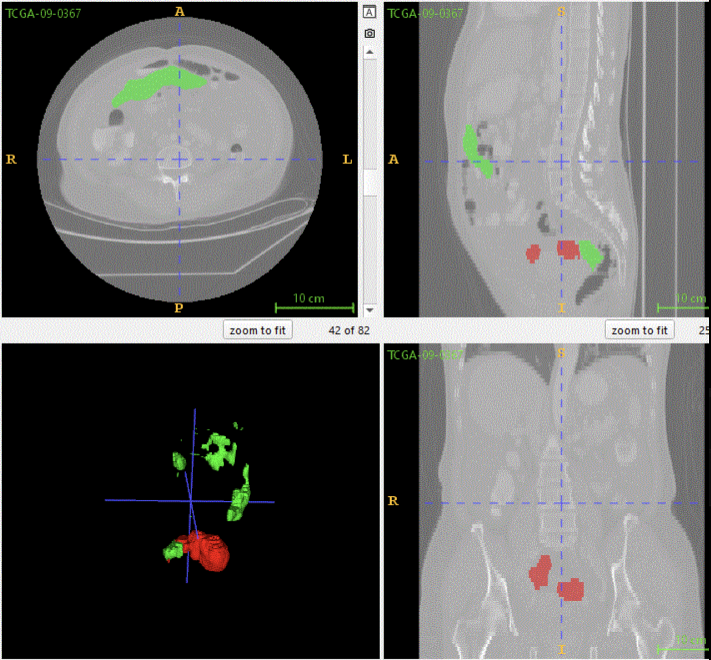

# PINKCC Inference

> An extension of the ovseg deep learning framework for automated segmentation of ovarian cancer with peritoneal carcinomatosis on CT scans, developed during the **PINKCC Challenge 2025**.

> [!WARNING] **Research Use Only.** This software is intended for research purposes only and has not been validated for clinical use. It must not be used for clinical diagnosis, treatment planning, or any other medical decision-making. The authors and contributors assume no responsibility for any clinical or diagnostic decisions made using this tool.

---

## Overview

This project extends [**ovseg**](https://github.com/ThomasBudd/ovseg), the deep learning segmentation framework introduced by Thomas Buddenkotte et al. in:

> **"Deep learning-based segmentation of multisite disease in ovarian cancer"** _European Radiology Experimental_, 2023. [PMC10700248](https://pmc.ncbi.nlm.nih.gov/articles/PMC10700248/) · [DOI: 10.1186/s41747-023-00388-z](https://doi.org/10.1186/s41747-023-00388-z)

Beyond the original ovseg framework, this work introduces the following contributions:

- **Modified architecture** — The model architecture was adapted to better handle the complexity of peritoneal carcinomatosis spread patterns.
- **Extended prediction classes** — The set of predicted segmentation classes and training batches were revised to reflect the target disease sites.
- **Fine-tuning on a dedicated dataset** — The model was fine-tuned on a curated collection of more than 300 ovarian CT scans focused on ovarian cancer with peritoneal carcinomatosis. This dataset was collected, anonymized, structured, and annotated by the clinical teams at the **Montpellier Cancer Institute**.

---

## Installation

```bash
pip install -e .
```

> **Requirements:** A CUDA-compatible GPU is required. Input images must be in NIfTI format (`.nii` or `.nii.gz`).

---

## Dataset Structure

Organise your dataset as follows before running inference. Predictions will be saved automatically under an `ovseg_predictions/` subfolder.

```
/path/to/DATASET/
    ├── image_001.nii.gz
    ├── image_002.nii.gz
    ├── ...
    └── ovseg_predictions/
```

---

## Running Inference

```bash
ovseg_inference /path/to/DATASET/ --models pinkcc
```



---

## Team

This project was developed during **PINKCC 2025** by :
- Angela Saade

- Alexis Le Trung

- Aurélien Daudin

- Baptiste Arnold

- Erwin Rodrigues

- Khaled Mili

- Maxim Bocquillon

- Samy Yacef

- Wassim Badraoui

---

## Citation

If you use this project in your work, please cite this GitHub repository and the authors' names alongside the original OVSEG paper:

```bibtex
@article{buddenkotte2023ovseg,
  title     = {Deep learning-based segmentation of multisite disease in ovarian cancer},
  author    = {Buddenkotte, Thomas and others},
  journal   = {European Radiology Experimental},
  year      = {2023},
  doi       = {10.1186/s41747-023-00388-z},
  pmcid     = {PMC10700248}
}
```

---

## License

Please refer to the original [ovseg repository](https://github.com/ThomasBudd/ovseg) for licensing terms.
